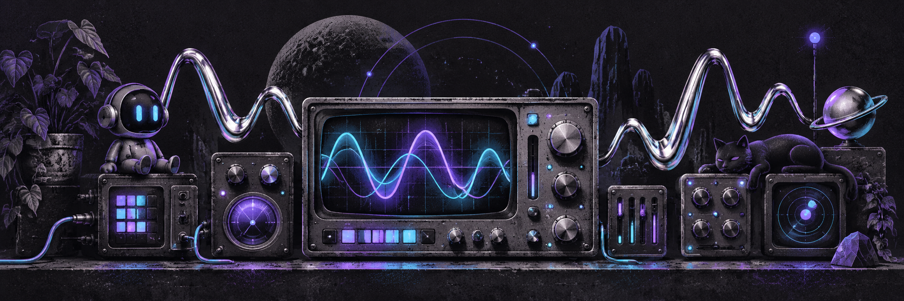

# DSI CHAT

<!-- project-header:start -->

<!-- project-header:end -->

<!-- project-badges:start -->
[](https://github.com/raiinman/DSI-CHAT)
[](https://github.com/raiinman/DSI-CHAT)
[](https://github.com/raiinman/DSI-CHAT/blob/rewrite/docs/INSTALLATION.md)
<!-- project-badges:end -->

<!-- project-live-badges:start -->
[](https://github.com/raiinman/DSI-CHAT/actions/workflows/build.yml) [](https://github.com/raiinman/DSI-CHAT/commits/rewrite) [](https://github.com/raiinman/DSI-CHAT/issues) [](https://github.com/raiinman/DSI-CHAT/stargazers)
<!-- project-live-badges:end -->

Dead Signal Interactive's Discord customization suite for **Android, desktop, and browsers**.

DSI CHAT integrates Revenge's Android engine and Equicord's desktop/browser engine. Equicord already includes Vencord's framework and plugin collection. They share a product identity, not a JavaScript runtime.

| Target | Engine | Included functionality | Output |
| --- | --- | --- | --- |
| Android | Revenge / Bunny / Vendetta lineage | Plugin management, themes, fonts, experiments, recovery, legacy Vendetta compatibility, DSI Clean Links | JavaScript bundle for a compatible loader |
| Desktop | Equicord / Vencord | Both upstream plugin collections, themes, QuickCSS, settings backup, diagnostics | Standalone injector bundles |
| Browser | Equicord / Vencord | Plugins supported by the web build, themes, QuickCSS, backup | Chromium/Firefox extensions and userscript |

## Build

Use Node.js 24 or newer. Package manager version is pinned in package.json.

```sh
npm install
npm run setup
npm test
npm run catalog
npm run build
npm run verify
```

Individual targets: `npm run build:mobile`, `npm run build:desktop`, `npm run build:web`.
Built files and checksums are collected in `release/`. See [installation](docs/INSTALLATION.md) and [current validation](docs/STATE.md).

The first [verified build](https://github.com/raiinman/DSI-CHAT/actions/runs/36826169778) contains a downloadable `dsi-chat-builds` artifact with all three targets.

## What is ours

DSI owns this fork's branding, integration, build orchestration, feature catalog, and original additions. Upstream authors retain credit for their code. Public APIs and storage keys retain their existing names for plugin and loader compatibility.

Android plugins cannot directly execute desktop Webpack/DOM plugins. A feature port must be implemented and tested against the Android client. Desktop account switching support does not imply an Android account switcher.

Upstream binary updates are disabled in desktop/web builds. DSI does not operate a cloud backend, app-store listing, Android APK manager, or installer yet. Optional upstream cloud and plugin services retain their upstream names.

The original fork is preserved in [legacy/vendetta](legacy/vendetta). Imported revisions are recorded in [upstream.lock.json](upstream.lock.json).

See [architecture](docs/ARCHITECTURE.md), [feature catalog](catalog/features.json), and [credits and licenses](THIRD_PARTY_NOTICES.md).
